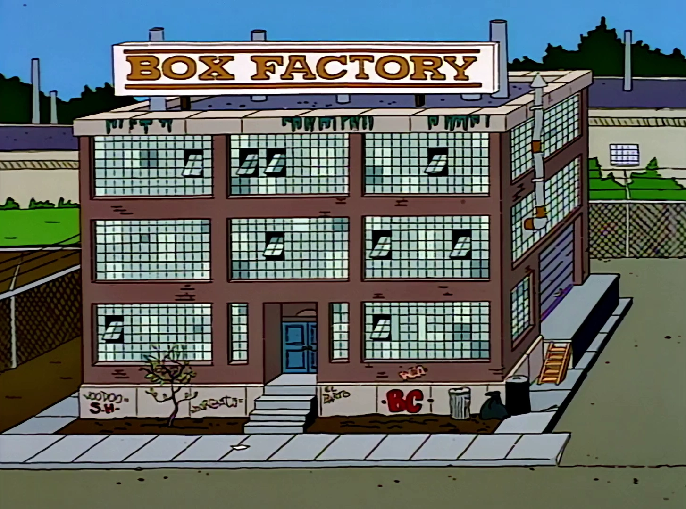

# Box Factory



A comprehensive toolkit for creating and managing Claude Code components. Box Factory provides specialized agents, slash commands, and design skills for building agents, commands, skills, and hooks—whether for plugins or standalone projects.

## Overview

Box Factory creates Claude Code components for **both plugins and standalone projects**. It automatically detects your context and puts files in the right place:

- **Marketplace context** (`marketplace.json` exists): Lists plugins to choose from
- **Plugin context** (`.claude-plugin/plugin.json` exists): Uses current plugin's directories
- **Standalone project**: Uses `.claude/` directories (agents, commands, skills, settings.json)

Every component in Box Factory follows the patterns it teaches, creating a self-documenting, self-consistent ecosystem.

**Core capabilities:**

- Create plugins, agents, commands, skills, and hooks with proper structure
- Validate components against official specifications and Box Factory design patterns
- Review existing components for quality and compliance
- Access expert design guidance through comprehensive skills
- Update plugin documentation automatically

## Features

### Commands

#### `/box-factory:add-plugin`

Create a new Claude Code plugin with complete scaffolding.

**What it does:**

- Creates proper directory structure (components at root, not in `.claude-plugin/`)
- Generates `plugin.json` with comprehensive metadata
- Writes detailed README and CLAUDE.md documentation
- Delegates component creation to specialized writer agents
- Validates Box Factory compliance before completing

**Usage:** `/box-factory:add-plugin`

#### `/box-factory:add-agent`

Create a new Claude Code agent.

**What it does:**

- Detects context (marketplace, plugin, or standalone project)
- Loads agent-design and box-factory-architecture skills for guidance
- Fetches current official agent documentation
- Creates agent with proper frontmatter and structure in the appropriate directory
- Validates tool selection matches responsibilities
- Ensures no user interaction language in prompt

**Usage:** `/box-factory:add-agent`

#### `/box-factory:add-command`

Create a new Claude Code slash command.

**What it does:**

- Detects context (marketplace, plugin, or standalone project)
- Loads slash-command-design and box-factory-architecture skills
- Creates command following thin wrapper delegation pattern in the appropriate directory
- Includes proper frontmatter with description
- Validates against command design best practices

**Usage:** `/box-factory:add-command`

#### `/box-factory:add-skill`

Create a new Claude Code skill.

**What it does:**

- Detects context (marketplace, plugin, or standalone project)
- Loads skill-design and box-factory-architecture skills
- Creates skill with fetch-first, two-layer structure in the appropriate directory
- Applies knowledge delta filter (only documents what Claude doesn't know)
- Validates progressive disclosure and proper subdirectory structure

**Usage:** `/box-factory:add-skill`

#### `/box-factory:add-hook`

Create a new Claude Code hook.

**What it does:**

- Detects context (marketplace, plugin, or standalone project)
- Loads hook-design and box-factory-architecture skills
- Creates hooks configuration in the appropriate location (plugin hooks.json or .claude/settings.json)
- Provides bash or Python+UV hook implementation
- Validates security, performance, and exit code patterns

**Usage:** `/box-factory:add-hook`

#### `/box-factory:validate-plugin [plugin-path]`

Validate a plugin's structure and components against official specs and Box Factory best practices.

**What it does:**

- Checks directory structure and file locations
- Validates JSON/YAML syntax in all components
- Detects forbidden patterns (user interaction, weak delegation)
- Verifies tool permissions match responsibilities
- Generates detailed report with file:line references

**Usage:** `/box-factory:validate-plugin [plugin-path]`

**Arguments:**

- `plugin-path` (optional): Path to plugin directory. Defaults to current directory.

#### `/box-factory:review-component [component-path]`

Review a component for quality, best practices, and design pattern compliance.

**What it does:**

- Identifies component type and loads relevant design skills
- Fetches current official documentation
- Analyzes against Box Factory design patterns
- Provides prioritized feedback (critical, important, minor)
- Suggests specific improvements with examples

**Usage:** `/box-factory:review-component [component-path]`

**Arguments:**

- `component-path`: Path to agent, command, skill, hook, or plugin to review

#### `/box-factory:update-docs [plugin-path]`

Update or regenerate README.md and CLAUDE.md documentation for a plugin.

**What it does:**

- Reads all plugin components and metadata
- Analyzes plugin purpose, features, and architecture
- Generates comprehensive README with usage examples
- Creates CLAUDE.md with development guidelines
- Follows Box Factory documentation patterns

**Usage:** `/box-factory:update-docs [plugin-path]`

**Arguments:**

- `plugin-path` (optional): Path to plugin directory. Defaults to current directory.

### Agents

Box Factory includes seven specialized agents that handle component creation and quality assurance:

#### Writer Agents

**box-factory:plugin-writer** - Creates complete plugins with scaffolding, delegates to component writers

- Tools: Bash, Read, Write, WebFetch, Glob, Grep, Task, Skill
- Loads: box-factory-architecture, plugin-design skills
- Validates: Directory structure, marketplace registration, Box Factory compliance

**box-factory:agent-writer** - Creates agents following agent-design patterns

- Tools: Bash, Read, Write, WebFetch, WebSearch, Skill
- Loads: box-factory-architecture, agent-design skills
- Validates: Tool selection, delegation description, no user interaction

**box-factory:slash-command-writer** - Creates commands following slash-command-design patterns

- Tools: Bash, Read, Write, WebFetch, Grep, Glob, Skill
- Loads: box-factory-architecture, slash-command-design skills
- Validates: Thin wrapper pattern, proper frontmatter, delegation to agents

**box-factory:skill-writer** - Creates skills following skill-design patterns

- Tools: Bash, Read, Write, WebFetch, Glob, Grep, Skill
- Loads: box-factory-architecture, skill-design skills
- Validates: Fetch-first approach, two-layer structure, knowledge delta filter

**box-factory:hooks-writer** - Creates hooks following hooks-design patterns

- Tools: Bash, Read, Write, WebFetch, Glob, Grep, Skill
- Loads: box-factory-architecture, hook-design skills (optionally uv-scripts for Python hooks)
- Validates: Security, performance, exit codes, matcher patterns

#### Quality Agents

**box-factory:validation-agent** - Validates plugins and components (read-only)

- Tools: Bash, Read, Grep, Glob, WebFetch, Skill
- Loads: box-factory-architecture and relevant design skills
- Validates: Structure, syntax, specifications, anti-patterns, MCP configuration

**box-factory:component-reviewer** - Reviews components for quality (read-only)

- Tools: Read, Grep, Glob, WebFetch, Skill
- Loads: box-factory-architecture and relevant design skills
- Provides: Prioritized feedback, specific recommendations, examples

### Skills

Box Factory includes comprehensive design guidance skills that provide interpretive guidance for creating high-quality Claude Code components:

#### `box-factory:agent-design`

Interpretive guidance for designing Claude Code agents and subagents.

**What it provides:**

- Agent architecture understanding (isolated context, return-based model)
- Critical gotchas: no user interaction, autonomous operation
- Tool selection philosophy (match tools to responsibilities)
- Description field design for autonomous delegation
- Quality checklist and common anti-patterns

**When to use:**

- Creating or reviewing agents
- Understanding isolated context model
- Ensuring agents follow best practices
- Debugging delegation failures

#### `box-factory:slash-command-design`

Interpretive guidance for designing Claude Code slash commands.

**What it provides:**

- Command vs agent vs skill decision framework
- Thin wrapper delegation pattern (command → agent)
- Argument syntax and best practices
- Tool restrictions and model selection
- Common pitfalls and how to avoid them

**When to use:**

- Creating or reviewing slash commands
- Deciding between command and other patterns
- Understanding command-specific features
- Learning delegation patterns

#### `box-factory:plugin-design`

Interpretive guidance for designing Claude Code plugins.

**What it provides:**

- Plugin architecture understanding (packaging, not functionality)
- Critical directory structure rules (components at root!)
- Marketplace distribution strategies
- Development workflow best practices
- Version management and semantic versioning
- MCP server configuration patterns

**When to use:**

- Creating or reviewing plugins
- Understanding marketplace distribution
- Planning multi-component packages
- Configuring MCP servers

#### `box-factory:hook-design`

Interpretive guidance for designing Claude Code hooks.

**What it provides:**

- Hook lifecycle and architecture
- Exit code communication patterns (0, 2, other)
- Security considerations (quoting, validation, sanitization)
- Event-specific usage patterns
- stdin/stdout handling
- Bash vs Python+UV decision framework

**When to use:**

- Creating or reviewing hooks
- Understanding deterministic control flow
- Implementing guaranteed execution patterns
- Securing hook implementations

#### `box-factory:skill-design`

Meta-skill that teaches how to design skills following Box Factory philosophy.

**What it provides:**

- Box Factory philosophy (low-maintenance, fetch-first, two-layer approach)
- Knowledge delta filter (only document what Claude doesn't know)
- When to create skills vs agents vs commands
- Structure for progressive disclosure
- Evidence-based recommendations
- Quality checklist and anti-patterns

**When to use:**

- Creating or reviewing skills
- Understanding skill architecture
- Learning Box Factory design principles
- Applying knowledge delta filter

#### `box-factory:box-factory-architecture`

Meta-skill for understanding Claude Code component architecture and interaction patterns.

**What it provides:**

- Isolation model (agents operate in isolated contexts)
- Return-based delegation (one-way communication)
- Progressive disclosure philosophy (token efficiency)
- Component comparison (agents, commands, skills, hooks)
- Interaction patterns (command→agent, agent→skill, agent→sub-agent)
- Cross-component design patterns
- Delegation chains and debugging

**When to use:**

- Choosing between component types
- Designing plugins with multiple components
- Understanding delegation patterns
- Debugging cross-component issues
- Creating Box Factory-compliant components

#### `box-factory:uv-scripts`

UV-specific patterns for single-file Python scripts using inline metadata (PEP 723).

**What it provides:**

- UV script shebang patterns
- Inline dependency declaration
- When to use UV vs bash for hooks
- Security and performance considerations

**When to use:**

- Creating Python hooks with dependencies
- Building standalone Python utilities
- Working in UV-managed projects

## Design Philosophy

Box Factory follows specific design principles that make components maintainable, high-quality, and resilient to change:

### Low-Maintenance by Design

**Skills and agents:**

- Defer all specific syntax to official documentation via WebFetch
- Focus on interpretation and best practices, not duplication
- Avoid hardcoding version-specific details (model names, tool lists)
- Remain valid as Claude Code evolves

**Why:** Documentation changes, but design principles and gotchas remain constant.

### Official Specs + Opinionated Guidance

**The two-layer approach:**

1. **Official Specification** - Always fetch current docs, cite them clearly
2. **Best Practices** - Add interpretive guidance the docs don't emphasize

**Example:** Docs say "description field for commands is optional." Best practice says "always include description - improves discoverability."

### Knowledge Delta Filter

**Skills should only document what Claude doesn't already know:**

- ✅ Include: User-specific preferences, edge cases, decision frameworks, new technology
- ❌ Exclude: Basic commands, standard workflows, general best practices for well-known tools

**Result:** Focused skills (~50-150 lines) that add real value, not comprehensive documentation that duplicates Claude's training.

### Evidence-Based Recommendations

**All claims should be:**

- Grounded in official documentation, OR
- Clearly marked as opinionated best practices, OR
- Based on common pitfalls and real-world experience

**Avoid:** Presenting opinions as official requirements or making unsupported claims.

### Delegation Pattern

**Commands are thin wrappers that delegate to specialized agents:**

```
User → /box-factory:add-agent → agent-writer agent
                                 ├── Loads: agent-design skill
                                 ├── Fetches: Official docs
                                 └── Creates: agent.md file
```

**Why this works:**

- Commands stay simple (argument handling)
- Agents handle complexity in isolation
- Skills provide interpretive guidance
- Clear separation of concerns

## When to Use Each Component Type

Understanding when to use each component type is critical for good architecture.

### Skill vs Agent vs Command vs Hook

**Use a Skill when:**

- Multiple contexts need the same knowledge
- Substantial procedural expertise that's reusable
- Progressive disclosure would save tokens
- Providing interpretive guidance
- Teaching "how to think about" something
- Documenting what Claude doesn't already know (knowledge delta)

**Use an Agent when:**

- Need isolated context (won't pollute main conversation)
- Want autonomous delegation (triggered by context)
- Complex decision-making or analysis involved
- Task runs as part of larger workflows
- Require specific tool restrictions
- Doing actual work (writing files, running tests)

**Use a Command when:**

- User wants explicit control over when it runs
- Simple, deterministic operation
- Wrapping a bash script or tool sequence
- One-off operations triggered by user
- Thin wrapper that delegates to specialized agent

**Use a Hook when:**

- Need guaranteed execution every time (deterministic)
- Simple, deterministic rule (format, lint, validate)
- Integrating with external tools
- Performance/safety enforcement
- Must happen at specific lifecycle event

### Decision Trees

**"I want to enforce something always happens"**
→ **Hook** (deterministic, guaranteed execution)

**"I want Claude to intelligently handle something"**
→ **Agent** (isolated context, autonomous delegation)

**"I want reusable knowledge/guidelines"**
→ **Skill** (knowledge that loads when relevant)

**"I want the user to trigger something"**
→ **Command** (explicit user control)

**"I need to package multiple related components"**
→ **Plugin** (distribution mechanism)

## Installation

### From the Marketplace

1. Add the marketplace (if not already added):

   ```
   /plugin marketplace add /path/to/neat-little-package
   ```

2. Install the plugin:

   ```
   /plugin install box-factory@neat-little-package
   ```

3. Start creating components!

### Manual Installation

1. Clone or copy the `box-factory` directory to your plugins location
2. Ensure proper structure:

   ```
   plugins/box-factory/
   ├── .claude-plugin/
   │   └── plugin.json
   ├── agents/
   ├── commands/
   ├── skills/
   ├── README.md
   └── CLAUDE.md
   ```

3. Use the `/plugin install` command or restart Claude Code

## Quick Start Guide

### Creating Your First Plugin

1. Run `/box-factory:add-plugin`
2. The plugin-writer agent will guide you through:
   - Plugin name and metadata
   - Initial components to include
   - Directory structure creation
3. Plugin is created with proper structure, README, and plugin.json
4. Install and test your new plugin

### Adding Features to Existing Plugins

**Add a command:**

```
/box-factory:add-command
```

Then provide context about what the command should do.

**Add a skill:**

```
/box-factory:add-skill
```

Then provide context about what knowledge the skill should provide.

**Add an agent:**

```
/box-factory:add-agent
```

Then provide context about what work the agent should perform.

**Add a hook:**

```
/box-factory:add-hook
```

Then provide context about what event and validation the hook should handle.

### Getting Design Guidance

Load design skills for expert guidance:

- `box-factory:agent-design` - Creating agents and subagents
- `box-factory:slash-command-design` - Creating slash commands
- `box-factory:plugin-design` - Creating and distributing plugins
- `box-factory:hook-design` - Creating lifecycle hooks
- `box-factory:skill-design` - Creating skills with Box Factory philosophy
- `box-factory:box-factory-architecture` - Understanding component interaction patterns

These skills will:

1. Fetch current official documentation
2. Provide interpretive guidance
3. Identify common pitfalls
4. Suggest best practices

### Validating and Reviewing Components

**Validate entire plugin:**

```
/box-factory:validate-plugin path/to/plugin
```

**Review specific component:**

```
/box-factory:review-component path/to/component.md
```

Both commands provide detailed reports with file:line references and specific recommendations.

## Component Design Best Practices

### Skills

**Do:**

- Apply knowledge delta filter (only document what Claude doesn't know)
- Fetch official docs with WebFetch every time
- Focus on interpretation, not duplication
- Distinguish official specs from best practices
- Avoid hardcoding version-specific information
- Mark opinionated guidance clearly
- Provide decision frameworks and gotchas

**Don't:**

- Duplicate official documentation
- Document basic commands Claude already knows
- Hardcode model names, tool lists, or syntax
- Present opinions as official requirements
- Make unsupported claims
- Create overlapping skills

**Philosophy:** Skills should document the delta between Claude's base knowledge and what's needed for this context.

### Agents

**Do:**

- Design for isolated context (no user interaction)
- Grant tools matching autonomous responsibilities
- Use directive description language for delegation
- Define single, focused responsibility
- Include clear constraints
- Load relevant design skills

**Don't:**

- Include user interaction language ("ask the user")
- Over-restrict tools (agent can't do its job)
- Create overly broad scope (one agent, many jobs)
- Hardcode version-specific details
- Forget to include Skill tool when loading skills

**Key insight:** Agents can't ask questions but should do actual work autonomously.

### Commands

**Do:**

- Keep action-oriented (not knowledge storage)
- Delegate to agents for complex logic
- Use simple arguments or let agents handle complexity
- Include description for discoverability
- Follow thin wrapper pattern

**Don't:**

- Store knowledge in commands (use skills)
- Reimplement agent logic
- Create overly complex arguments
- Skip the description field

**Key insight:** Most robust commands delegate to specialized agents.

### Hooks

**Do:**

- Keep fast (< 60s or set custom timeout)
- Use exit 2 only for critical blocking
- Quote all variables
- Validate and sanitize inputs
- Test in safe environments first
- Include clear error messages

**Don't:**

- Block everything with aggressive matchers
- Create slow hooks without custom timeouts
- Assume user interaction
- Ignore security (path traversal, etc.)
- Forget to handle errors gracefully

**Key insight:** Hooks execute automatically on every event - they must be fast, safe, and reliable.

### General

**Do:**

- Version plugins semantically (1.0.0 → 1.1.0 → 2.0.0)
- Document everything in README files
- Test thoroughly after changes
- Use lowercase, hyphenated names
- Keep JSON files properly formatted
- Reference official docs for current details

**Don't:**

- Make breaking changes without bumping major version
- Skip documentation
- Use spaces or special characters in names
- Commit without testing
- Hardcode details that will become outdated

## Development Workflow

### Iterative Development

1. Create or modify plugin files
2. Uninstall the plugin:

   ```
   /plugin uninstall [plugin-name]@marketplace-name
   ```

3. Reinstall the plugin:

   ```
   /plugin install [plugin-name]@marketplace-name
   ```

4. Test the changes
5. Repeat as needed

### Testing Components

**Commands:**

```
/command-name
```

Verify it behaves as expected.

**Skills:**

Use the Skill tool to load the skill, then test it in various scenarios.

**Agents:**

Reference the agent in prompts or let delegation trigger it, then verify behavior.

**Hooks:**

Make a change that triggers the hook event, press CTRL-R to view execution.

### Validation Workflow

Before publishing or sharing a plugin:

1. Run `/box-factory:validate-plugin` to check structure and compliance
2. Review each component with `/box-factory:review-component`
3. Fix any issues identified in validation reports
4. Update documentation with `/box-factory:update-docs`
5. Test all components end-to-end
6. Version bump in plugin.json

## File Structure Reference

```
plugin-name/
├── .claude-plugin/
│   └── plugin.json          # Required: Plugin metadata
├── commands/                # Optional: Slash commands
│   ├── command1.md
│   └── command2.md
├── skills/                  # Optional: Agent skills
│   ├── skill1/
│   │   └── SKILL.md
│   └── skill2/
│       └── SKILL.md
├── agents/                  # Optional: Custom agents
│   ├── agent1.md
│   └── agent2.md
├── hooks/                   # Optional: Event handlers
│   ├── hooks.json
│   └── script.sh
├── README.md               # Recommended: User documentation
└── CLAUDE.md              # Recommended: Development guidelines
```

**Critical:** All component directories must be at plugin root, NOT inside `.claude-plugin/`.

## Troubleshooting

### Plugin not showing up

- Verify plugin.json is valid JSON
- Check that plugin is registered in marketplace.json
- Try removing and re-adding the marketplace
- Ensure directory structure is correct (components at root)

### Command not working

- Ensure command file is in `commands/` directory
- Check that filename matches command name (kebab-case)
- Verify YAML frontmatter is properly formatted
- Reinstall the plugin
- Check `/help` to see if command appears

### Skill not recognized

- Verify SKILL.md exists in `skills/[skill-name]/` directory
- Check YAML frontmatter formatting
- Ensure skill directory name is lowercase, hyphenated
- Filename must be `SKILL.md` (uppercase)
- Reinstall the plugin
- Use Skill tool to verify it appears in list

### Agent not being invoked

- Check description field uses directive language ("ALWAYS use when...")
- Verify agent file is in `agents/` directory
- Ensure tools list matches agent's responsibilities
- Look for user interaction language (forbidden)
- Test by explicitly requesting the agent
- Verify Skill tool is included if agent loads skills

### Hook not firing

- Verify hooks configuration in settings.json or hooks.json
- Review and approve hooks via `/hooks` menu
- Check matcher syntax (case-sensitive)
- Press CTRL-R to view hook execution logs
- Ensure hook exits properly (exit 0, 2, or other)

### Changes not taking effect

- Always reinstall the plugin after making changes
- Check for syntax errors in JSON/markdown files
- Verify file paths are correct
- Restart Claude Code if needed

### Validation failures

Run `/box-factory:validate-plugin` to see specific issues with file:line references and recommendations for fixes.

## Resources

### Official Documentation

Always fetch current documentation:

- **Plugins**: <https://code.claude.com/docs/en/plugins>
- **Slash Commands**: <https://code.claude.com/docs/en/slash-commands>
- **Agents**: <https://code.claude.com/docs/en/sub-agents>
- **Hooks**: <https://code.claude.com/docs/en/hooks>

### Design Skills (Included in Box Factory)

Use these skills for expert guidance:

- `box-factory:agent-design` - Agent and subagent design
- `box-factory:slash-command-design` - Command design and best practices
- `box-factory:plugin-design` - Plugin architecture and distribution
- `box-factory:hook-design` - Hook lifecycle and patterns
- `box-factory:skill-design` - Skill creation following Box Factory philosophy
- `box-factory:box-factory-architecture` - Component interaction and ecosystem patterns
- `box-factory:uv-scripts` - Python scripts with inline dependencies

### Design Philosophy Summary

- **Low-maintenance:** Defer to official docs via WebFetch, avoid hardcoding
- **Two-layer approach:** Official specs + opinionated guidance
- **Knowledge delta:** Only document what Claude doesn't know
- **Evidence-based:** All recommendations grounded in docs or clearly marked as opinions
- **Delegation pattern:** Commands delegate to specialized agents that follow design skills

## Examples

See the component files in this plugin for examples:

- **Agents**: `agents/plugin-writer.md`, `agents/agent-writer.md`
- **Commands**: `commands/add-plugin.md`, `commands/add-agent.md`
- **Skills**: `skills/agent-design/SKILL.md`, `skills/skill-design/SKILL.md`
- **README**: This file follows Box Factory documentation patterns
- **CLAUDE.md**: Development guidelines following Box Factory patterns

Every component in Box Factory is a working example of the patterns it teaches.
