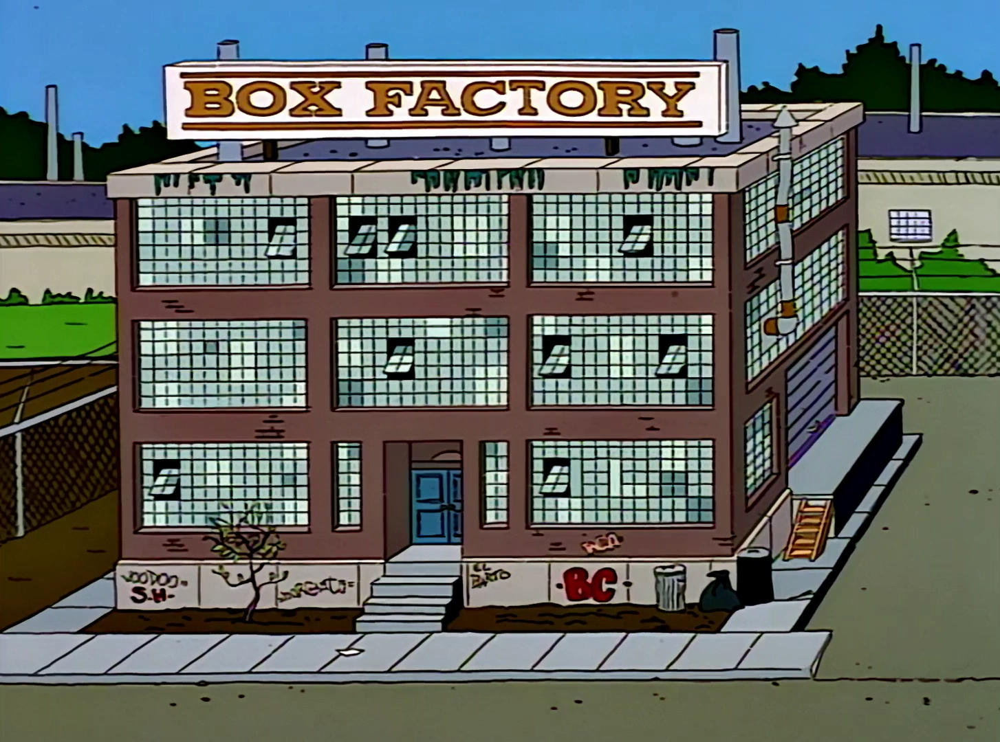

# Box Factory

Guidance and guardrails for building coding agent components.

## Overview

- Teaches when to use skills vs agents vs hooks vs memory (Claude-specific)
- Corrects gotchas Claude consistently gets wrong (sub-agent isolation, colors)
- Encodes user preferences (knowledge delta, minimal plugin.json, terse READMEs, CLI over MCP)
- Universal Agent Skills guidance for cross-platform portability (Claude, Gemini, Codex, etc.)
- Read-only component reviewer agent for validating against official specs
